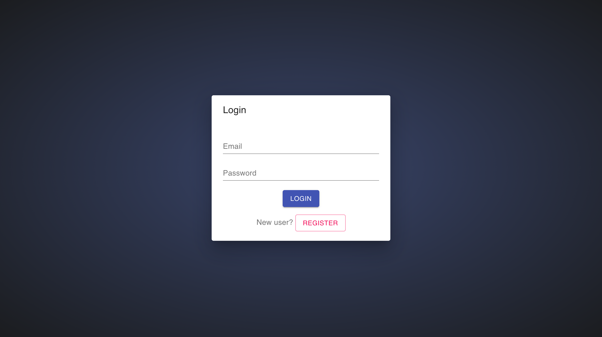
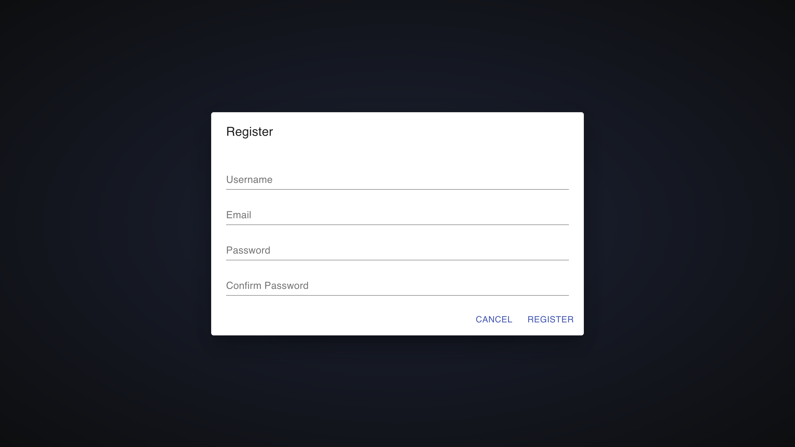
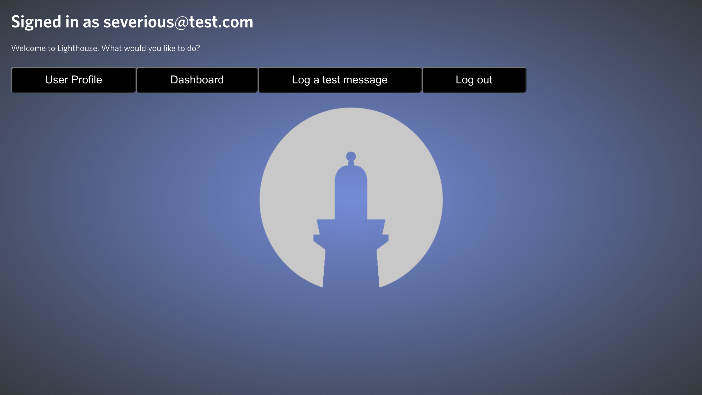
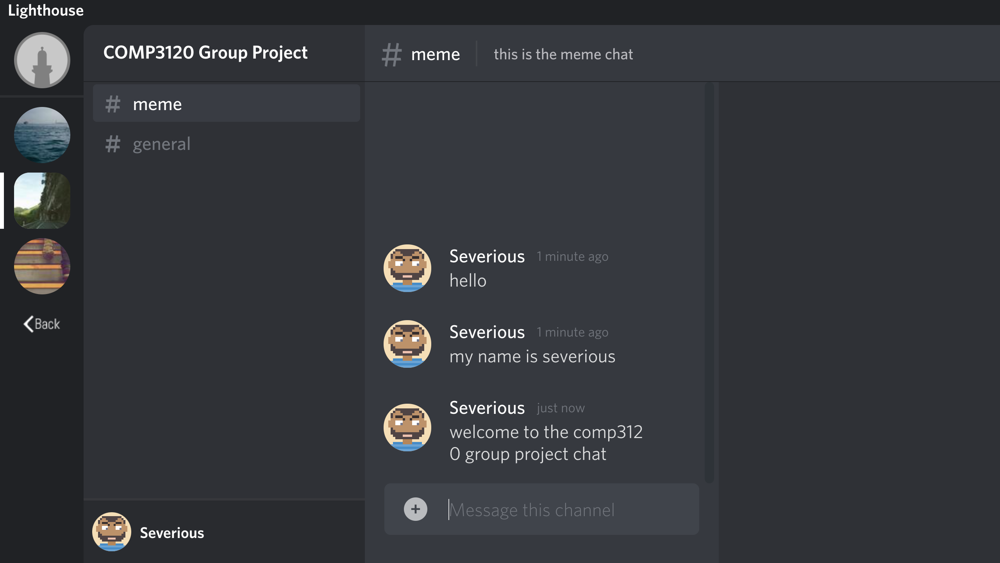
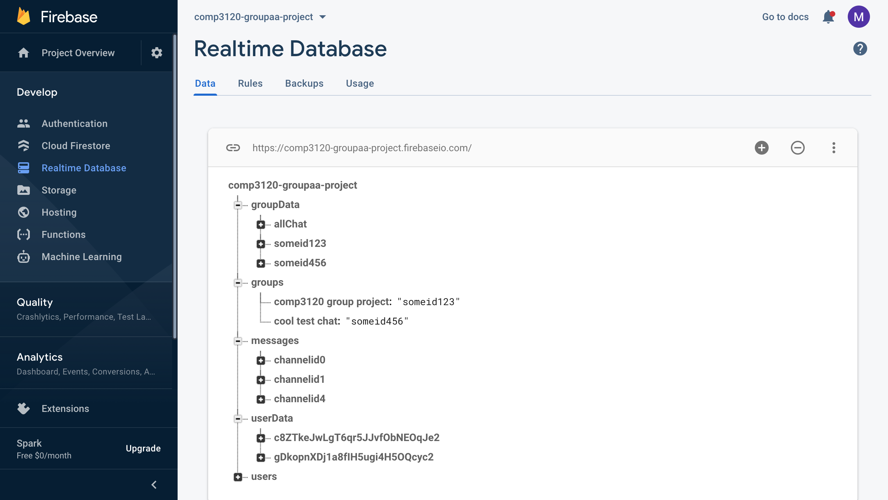

# COMP3120 Group AA Application - Lighthouse Realtime Chat

This group project was created using [Create React App](https://github.com/facebook/create-react-app)

## Project Outline
The application we have created is a messaging platform where users can communicate with each other in real-time; taking inspiration form the popular messaging platform [Discord](https://discord.com/). Users are able to communicate with each other or, if they prefer, create groups where they can message other users who are also part of that group. This project was aimed at capturing a young demographic by creating a simple, clutter-free interface that allows communication without any distraction. We aimed to build a fully featured application but with the tight time constrainsts were limited to what we could achieve; especially working with new components and on new platforms including [firebase](https://firebase.google.com/).  

## Description of MVP
The MVP was able to include the functionality we aimed for at the outset in the project proposal. These include:
- User registration and login
- User sign-out
- Creating chat groups
- Joining groups
- View user profiles
- Unique user profile images
- Group Images
- Real-time messaging (appears as each user posts, continuously scrolls to the latest message)
- Multiple views (for each group chat)

As mentioned, the limited project timeline meant we needed to work efficiently. We first set up the firebase and Github repositories, created a base application and implemented some basic functionality. We then decided on what features we would like to implement and what was possible in the given timeframe. With the remaining time we populated the database, implemented the listed features, revised the features, implemented some styling and worked on more (some unsuccessfully, which we have included below to look at in the future).

## Guide to Project Source Code
The application is simple by nature as an instant messaing platform.
Users are able to:
- Sign in
- Log out
- View their user profile
- Go to the dashboard where they can message groups and rooms in real-time

The dashboard is the main functionality of the application and where users will spend most of thier time. Users are able to view and join chats in groups as well as rooms within these groups to futher distinguish certain chat rooms between users. All messages appear in real time after a users sends a message with timestamps that update too. Users can tage each other and delete messages by pressing the trash can next to any of their messages which will remove it form the conversation.

Styling was done with a combination of css, inline styling and Material-UI for the bulk of the work, which gave us a clean looking application with a relatively quick styling process and design modularity and customisability.

The project is seperated into the functions folder which contains the middleware and controller for the api. The bulk of the functionality is contained in the src folder with the main base application files as well as the folders housing the styling, services and most importantly all the components. 

### Components
- Spinner: displayed to users between components loading.

- Login form: Dispayed if no user is logged in, users can input their information and login or choose to register. 

- Registration form: Users can inout their username, email and password to register with the application which registers a user into firebase.

- Home: This is the fisrt page a user sees when they login. They can view their user profile, go to the dashboard or logout.

- Dashboard: The dashboard is the main component of the application. The user can navigate between groups and chat rooms within these groups by clicking on the icons and rooms. Users can post messages into their groups and chat rooms which are logged and timestamps are displayed in real-time. Users can tag each other and also delete messages.

- Firebase: Below is a screenshot of an example realtime database in firebase

Check the SCREENSHOTS folder for more images of the application in action.

## Next Steps in the Future
On the outset of this project, our group was aiming to implement many additional features and functionality compared to what was achieved in the end. The group hoped to create a much more complex web application but understood that the limited time would result in a less featured MVP. The deployed application contains the base components for the application but our proposal listed some more comprehensive additions that we would like to add in the future including:
- Auido feedback for actions when receiving messages
- Implementing a News API that sends through the latest headline every 'x' minutes into the messaging feed
- Automated messages (similar to News API; a bot that would display automated messages at given increments)
- Implement testing for all components (unsuccessfully implemented, removed due to not functioning correctly with firebase)
- Creating and switching between sub-groups
- Video embedding
- Audio messaging
- Content filters

## Group AA
- Nathan Soares (45382417)
> Front and Back-end development, Database Integration
- Michael Dimovski (45270708)
> Design, testing, reports, misc tasks
- Robert Kanepe (45364265)
> Database, design, misc tasks
- Bhavya Bhavsar (45560935)
> Front and Back-end development, misc tasks

***

## TODO

- Implement firebase access rules
